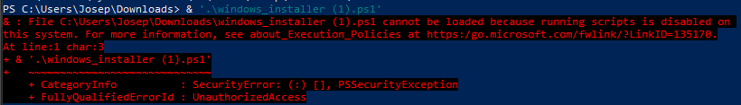

********************
Installation and use
********************

.. contents:: Table of Contents
    :local:
    :depth: 2

To install the CodeChat System, install the CodeChat Server and a CodeChat extension or plugin, along with optional external renderers you desire.

.. _install CodeChat Server:

CodeChat Server Installation
============================
 .. note:

    Troubleshooting blocks could be condensed and common troubleshooting techniques between OS's merged.

To install the CodeChat Server:

Windows
-------
#.  Go to this `link <https://github.com/JoeKenn1118/CodeChat_system/releases/tag/v0.0.1>`_ and download the Powershell script (``windows_installer.ps1``)

#. Open up Powershell in Admin mode

#. ``cd`` to the file location

#. Run ``windows_installer.ps1``

Troubleshooting
^^^^^^^^^^^^^^^^

- If Powershell shows an error informing you that running scripts is forbidden on your system, follow these additional steps
    - Open Powershell in administator mode
    - type ``Set-ExecutionPolicy RemoteSigned``
    - Run Powershell Script again

- If you wish to install your own version of Python make sure you are checking the Add to PATH checkbox on installation

Linux
-----

#.  `Open a terminal <https://www.howtogeek.com/howto/22283/four-ways-to-get-instant-access-to-a-terminal-in-linux/>`__.

#.  Highlight this entire command: `wget <https://raw.githubusercontent.com/JoeKenn1118/CodeChat_system/master/CodeChat_Server/codechat.sh && bash codechat.sh>`_ and press Ctrl-C to copy. Go to the terminal window and press Ctrl-Shift-V. Press Enter.

or

#.  Download `codechat.sh <https://github.com/JoeKenn1118/CodeChat_system/releases>`__ to the directory where you want to install it.

#.  `Open a terminal <https://www.howtogeek.com/howto/22283/four-ways-to-get-instant-access-to-a-terminal-in-linux/>`__ in that directory.

#.  Type ``bash codechat.sh``

Troubleshooting
^^^^^^^^^^^^^^^^

- If you don't have permission to run codechat.sh, type ``chmod 700 codechat.sh`` and try again.

- CodeChat requires `an up-to-date installation of Python 3 <https://www.geeksforgeeks.org/how-to-download-and-install-python-latest-version-on-linux/>`__. 

Mac
---
#.  `Open a terminal <https://support.apple.com/guide/terminal/open-or-quit-terminal-apd5265185d-f365-44cb-8b09-71a064a42125/mac>`__.

#.  `Install modern Python <https://opensource.com/article/19/5/python-3-default-mac>`_.

#.  Make sure pip, the Python installer, is `up to date`_: at the terminal, type ``python3 -m pip install --user --upgrade pip``.

#.  `Create a virtual environment`_ named *codechat* by typing ``python3 -m venv codechat``. This keeps the installation of the CodeChat System from interfering with other installed Python programs and vice versa.

#.  `Activate this virtual environment`_ by typing ``source codechat/bin/activate``.

#.  Install the CodeChat Server by typing ``python3 -m pip install --upgrade CodeChat_Server``.

#.  Determine the location of the installed CodeChat Server by typing ``which CodeChat_Server``. You'll need to enter this path when setting up the CodeChat plugin/extension in your IDE.

#.  Install the `CodeChat extension/plugin <../extensions/contents>`_ for your IDE or text editor.

To update the CodeChat Server, repeat steps 1, 5, and 6.

CodeChat extension/plugin installation
======================================
Install a `CodeChat plugin or extension <https://codechat-system.readthedocs.io/en/latest/extensions/contents.html>`_ to use the CodeChat System (the final required step of the installation steps above).

Renderers
=========
Renderers transform a textual source document into HTML, which the CodeChat System can then display. The CodeChat System `includes several renderers <included renderers_>`_; you may also optionally install `additional renderers`_.

Included renderers
------------------
The CodeChat Server includes built-in renderers for `reStructuredText <https://docutils.sourceforge.io/rst.html>`_, `Markdown <https://www.markdownguide.org/>`_, and (x)HTML; simply open any ``.rst``, ``.md``,  or ``.(x)htm(l)`` document and see it rendered live! In addition, the built-in `CodeChat <https://codechat.readthedocs.io/>`_ renderer allows you to transform source code in `many languages <https://codechat.readthedocs.io/en/master/CodeChat/CommentDelimiterInfo.py.html#supported-languages>`_ to a beautifully-formatted web page; likewise, simply open a source file to see it rendered live.

Additional renderers
--------------------
The CodeChat System has (limited) support for `Pandoc <https://pandoc.org/>`_. Install this and ensure it's in the path; the CodeChat Server will then use it to render a wider range of files.

The CodeChat System also works with project-based external renderers, by providing a CodeChat project configuration file (`example <../codechat_config.yaml>`) for that renderer. The ``templates/`` directory provides templates demonstrating a basic project for the following external renderers; each template includes the correct CodeChat project configuration file.

.. Docs note: since the ``conf.py`` for this project includes the ``templates/`` directory in the ``html_static_path`` list, then all the third-party build docs are copied there after a build. Hence, the paths to ``../static``.

Templates
^^^^^^^^^
-   `Doxygen <https://www.doxygen.nl/>`_ (`rendered template <../_static/doxygen/_build/html/index.html>`__)
-   `Javadoc <https://en.wikipedia.org/wiki/Javadoc>`_ (`rendered template <../_static/javadoc/_build/index.html>`__)
-   `Mdbook <https://rust-lang.github.io/mdBook/>`_ (`rendered template <../_static/mdbook/book/index.html>`__)
-   `Mkdocs <https://www.mkdocs.org/>`_ (`rendered template <../_static/mkdocs/site/index.html>`__)
-   `PreTeXt <https://pretextbook.org/>`_ (`rendered template <../_static/pretext/_build/index.html>`__)
-   `Runestone Components <https://runestone.academy/>`_ (`rendered template <../_static/runestone/build/runestone_template/index.html>`__)
-   `Sphinx <https://www.sphinx-doc.org/en/master/index.html>`_ (`rendered template <../_static/sphinx/_build/index.html>`__) -- note that this documentation is produced using CodeChat with Sphinx; see `../codechat_config.yaml` and `../conf.py`.

To use these templates:

#.  Install the external renderer.
#.  Make a copy of the appropriate template. These files are available via `Github <https://github.com/bjones1/CodeChat_system/tree/master/CodeChat_Server/CodeChat_Server/templates>`_, installed with the CodeChat Server via ``pip``/your favorite Python package manager, and also available via the "show source" link on these web pages.
#.  Open a file from the copied template in the CodeChat System to edit and render them.

To use the CodeChat System with an external renderer not listed above:

#.  Install the desired external renderer.
#.  Create a new project following the external renderer's instructions.
#.  Place a CodeChat project configuration file at the root of this newly-created project.
#.  Open any file supported by the external renderer in this newly created project. The CodeChat System will automatically render it.

Use
===
See the `home page <../index>` for a brief overview of the CodeChat Client GUI.
